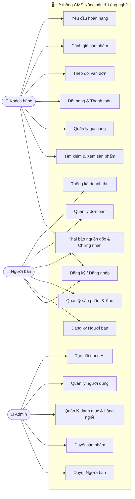
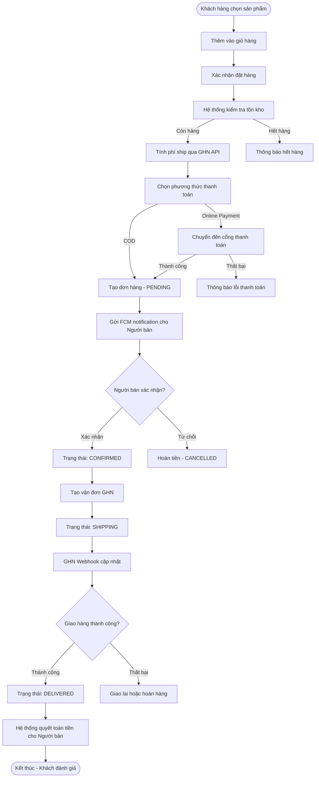
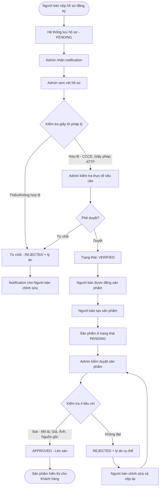
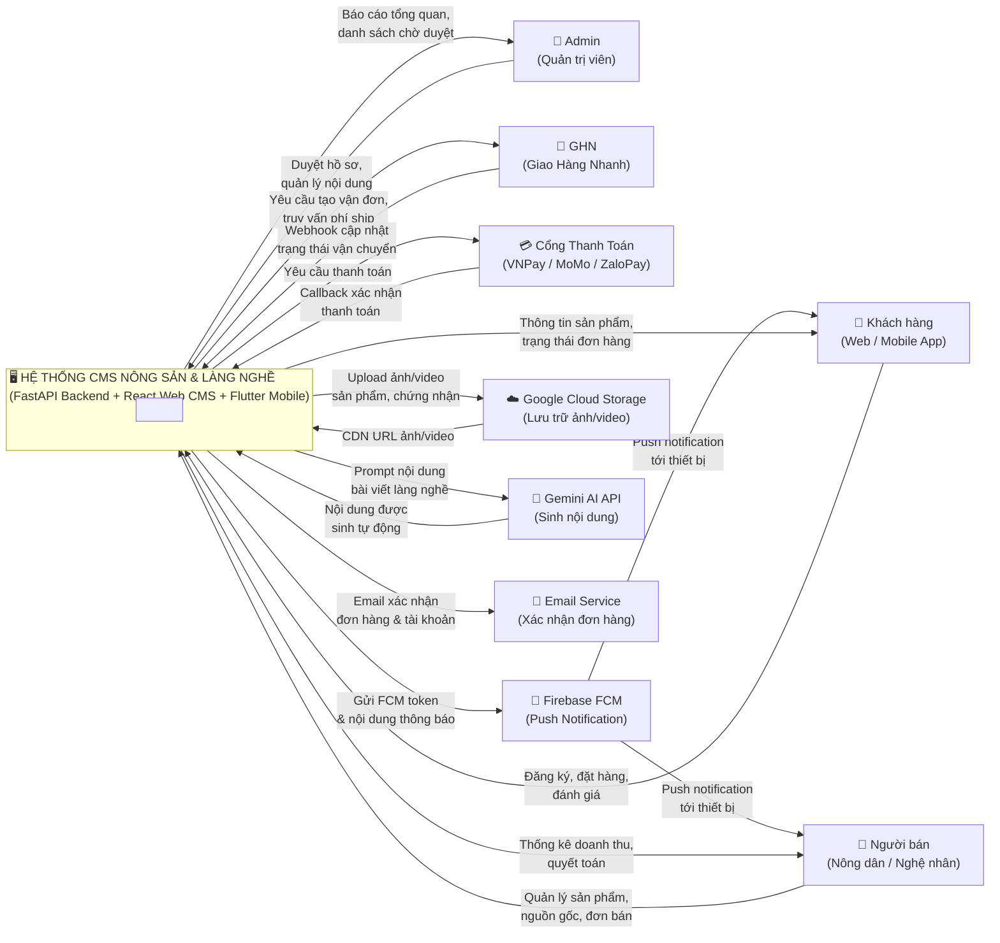

## 3.3 Sơ Đồ Use Case

### 3.3.1 Use Case Tổng Quát

---

### 3.3.2 Bảng Đặc Tả Use Case Chi Tiết

#### UC-04: Đặt Hàng & Thanh Toán

| Trường | Nội dung |
|--------|----------|
| **Mã Use Case** | UC-04 |
| **Tên** | Đặt hàng và thanh toán |
| **Tác nhân chính** | Khách hàng |
| **Tác nhân phụ** | Hệ thống GHN (tính phí ship), Cổng thanh toán (VNPay/MoMo) |
| **Mô tả** | Khách hàng xác nhận giỏ hàng, chọn địa chỉ, chọn PTTT, hoàn thành thanh toán |
| **Điều kiện tiên quyết** | Khách hàng đã đăng nhập, giỏ hàng có ít nhất 1 sản phẩm, sản phẩm còn hàng |
| **Luồng chính** | 1. Khách xem giỏ hàng và nhấn "Đặt hàng"  2. Chọn/nhập địa chỉ giao hàng  3. Hệ thống gọi GHN API tính phí vận chuyển  4. Khách nhập mã coupon (nếu có), hệ thống kiểm tra và áp dụng  5. Khách chọn phương thức thanh toán  6. Khách xác nhận đặt hàng  7. Hệ thống tạo đơn hàng, trừ tồn kho  8. Nếu PTTT online → chuyển hướng tới cổng thanh toán  9. Cổng thanh toán callback xác nhận → cập nhật trạng thái PAID  10. Hệ thống gửi FCM notification cho Người bán  11. Hệ thống gửi email xác nhận cho Khách hàng |
| **Luồng thay thế** | A1 (Thanh toán thất bại): Cổng thanh toán trả về lỗi → đơn hàng ở trạng thái PENDING, khách thử lại  A2 (Hết hàng): Hệ thống báo lỗi, yêu cầu cập nhật giỏ hàng |
| **Kết quả** | Đơn hàng tạo thành công, người bán nhận thông báo, khách nhận email xác nhận |
| **Ngoại lệ** | Lỗi kết nối cổng thanh toán → ghi log, thông báo lỗi thân thiện |

---

#### UC-14: Duyệt Sản Phẩm

| Trường | Nội dung |
|--------|----------|
| **Mã Use Case** | UC-14 |
| **Tên** | Kiểm duyệt sản phẩm |
| **Tác nhân chính** | Admin |
| **Mô tả** | Admin xem xét sản phẩm chờ duyệt, kiểm tra từng tiêu chí, phê duyệt hoặc từ chối |
| **Điều kiện tiên quyết** | Admin đã đăng nhập, có ít nhất 1 sản phẩm trạng thái PENDING |
| **Luồng chính** | 1. Admin vào danh sách sản phẩm chờ duyệt  2. Chọn sản phẩm để xem chi tiết  3. Kiểm tra 4 tiêu chí: Mô tả, Giá hợp lý, Ảnh rõ ràng, Nguồn gốc/Chứng nhận  4. Đánh dấu tích (✓) từng tiêu chí đã kiểm tra  5. Nếu đạt → nhấn "Phê duyệt" → trạng thái chuyển APPROVED  6. Hệ thống gửi FCM notification cho Người bán |
| **Luồng thay thế** | A1 (Không đạt): Admin nhập lý do từ chối → trạng thái chuyển REJECTED → notification tới người bán |
| **Kết quả** | Sản phẩm được công bố lên sàn (APPROVED) hoặc trả về cho người bán chỉnh sửa (REJECTED) |

---

#### UC-10: Khai Báo Nguồn Gốc Sản Phẩm

| Trường | Nội dung |
|--------|----------|
| **Mã Use Case** | UC-10 |
| **Tên** | Khai báo và xác minh nguồn gốc sản phẩm |
| **Tác nhân chính** | Người bán |
| **Tác nhân phụ** | Admin (xác minh) |
| **Mô tả** | Người bán nhập thông tin truy xuất nguồn gốc, đính kèm chứng nhận; Admin xác minh |
| **Điều kiện tiên quyết** | Người bán đã có sản phẩm trong hệ thống |
| **Luồng chính** | 1. Người bán vào trang chi tiết sản phẩm → tab "Nguồn gốc"  2. Nhập thông tin: tên làng nghề/vùng sản xuất, tên cơ sở, mã lô, ngày sản xuất, hạn dùng  3. Nhập nguyên liệu, quy trình sản xuất, hướng dẫn bảo quản  4. Upload ảnh minh chứng và file chứng nhận (OCOP, VietGAP, ISO…)  5. Lưu → trạng thái nguồn gốc: PENDING xác minh  6. Admin nhận thông báo, vào xác minh hồ sơ  7. Admin xác minh → VERIFIED; hoặc từ chối → REJECTED kèm lý do |
| **Kết quả** | Sản phẩm hiển thị badge chứng nhận (OCOP/VietGAP/Làng nghề), tăng độ tin cậy |

---

## 3.4 Quy Trình Nghiệp Vụ (Activity Diagram)

### 3.4.1 Quy Trình Đặt và Giao Hàng Nông Sản

### 3.4.2 Quy Trình Kiểm Soát Chất Lượng / Duyệt Gian Hàng

---

## 3.5 Sơ Đồ Ngữ Cảnh (Context Diagram)

---

## 3.6 Danh Sách Bảng Dữ Liệu (Data Dictionary)

### Bảng 1: `users` — Tài Khoản Người Dùng

| Tên cột | Kiểu dữ liệu | Ràng buộc | Mô tả |
|---------|-------------|-----------|-------|
| id | INT | PK, AUTO_INCREMENT | Mã định danh tài khoản |
| email | VARCHAR(255) | UNIQUE, NOT NULL | Địa chỉ email đăng nhập |
| password_hash | VARCHAR(255) | NOT NULL | Mật khẩu đã mã hóa bcrypt |
| name | VARCHAR(255) | NOT NULL | Họ và tên đầy đủ |
| date_of_birth | DATE | NULL | Ngày sinh |
| gender | VARCHAR(50) | NULL | Giới tính |
| type | VARCHAR(50) | NULL | Loại TK: consumer, producer, admin |
| status | ENUM | NOT NULL | ACTIVE / SUSPENDED / BANNED |
| fcm_token | VARCHAR(512) | NULL | Token Firebase Cloud Messaging |
| avatar_url | VARCHAR(512) | NULL | URL ảnh đại diện (Cloud Storage) |
| created_at | TIMESTAMP | DEFAULT NOW() | Thời gian tạo tài khoản |

### Bảng 2: `seller_profiles` — Hồ Sơ Người Bán

| Tên cột | Kiểu dữ liệu | Ràng buộc | Mô tả |
|---------|-------------|-----------|-------|
| id | INT | PK | Mã hồ sơ |
| user_id | INT | FK(users), UNIQUE | Liên kết tài khoản người bán |
| business_name | VARCHAR(255) | NOT NULL | Tên cơ sở kinh doanh / shop |
| business_type | ENUM | NOT NULL | HOUSEHOLD / COOPERATIVE / COMPANY |
| id_card_number | VARCHAR(20) | NULL | Số CCCD/CMND |
| food_safety_cert_url | TEXT | NULL | URL chứng nhận ATTP |
| tax_id | VARCHAR(50) | NULL | Mã số thuế |
| bank_account_number | VARCHAR(50) | NULL | Số tài khoản ngân hàng |
| verification_status | ENUM | NOT NULL | PENDING / VERIFIED / REJECTED |
| verified_by | INT | FK(users), NULL | Admin thực hiện xác minh |
| verified_at | TIMESTAMP | NULL | Thời điểm xác minh |

### Bảng 3: `products` — Sản Phẩm

| Tên cột | Kiểu dữ liệu | Ràng buộc | Mô tả |
|---------|-------------|-----------|-------|
| id | INT | PK | Mã sản phẩm |
| name | VARCHAR(255) | NOT NULL | Tên sản phẩm |
| description | TEXT | NULL | Mô tả chi tiết |
| price | NUMERIC(10,2) | NOT NULL | Giá bán (VNĐ) |
| seller_id | INT | FK(users) | Người bán |
| store_id | INT | FK(stores) | Gian hàng |
| category_id | INT | FK(categories) | Danh mục sản phẩm |
| product_type | ENUM | NULL | AGRICULTURAL / HANDICRAFT |
| sku | VARCHAR(100) | UNIQUE, NULL | Mã SKU |
| slug | VARCHAR(255) | UNIQUE, NULL | URL thân thiện SEO |
| stock_quantity | INT | NOT NULL | Số lượng tồn kho |
| status | ENUM | NOT NULL | PENDING / APPROVED / REJECTED |
| label | ENUM | NULL | CLEAN_AGRICULTURE / TRADITIONAL_CRAFT / OCOP |
| weight | INT | NULL | Trọng lượng (gram) |
| vat_rate | NUMERIC(5,2) | NULL | Tỷ lệ VAT (%) |
| published_at | TIMESTAMP | NULL | Thời điểm bắt đầu hiển thị |

### Bảng 4: `orders` — Đơn Hàng

| Tên cột | Kiểu dữ liệu | Ràng buộc | Mô tả |
|---------|-------------|-----------|-------|
| id | INT | PK | Mã đơn hàng |
| order_number | VARCHAR(50) | UNIQUE, NOT NULL | Mã hiển thị cho khách (ORD-20240101-001) |
| customer_id | INT | FK(users) | Khách hàng đặt hàng |
| seller_id | INT | FK(users) | Người bán |
| shipping_address | TEXT | NOT NULL | Địa chỉ giao hàng đầy đủ |
| subtotal | NUMERIC(15,2) | NOT NULL | Tổng tiền hàng |
| shipping_fee | NUMERIC(10,2) | NOT NULL | Phí vận chuyển (GHN) |
| discount_amount | NUMERIC(10,2) | NOT NULL | Số tiền giảm giá |
| total_amount | NUMERIC(15,2) | NOT NULL | Tổng thanh toán |
| platform_fee_amount | NUMERIC(10,2) | NOT NULL | Phí hoa hồng nền tảng |
| seller_amount | NUMERIC(15,2) | NOT NULL | Tiền thực nhận của người bán |
| status | ENUM | NOT NULL | PENDING/CONFIRMED/SHIPPING/DELIVERED/CANCELLED |
| payment_method | ENUM | NOT NULL | COD / VNPAY / MOMO / ZALOPAY |
| payment_status | VARCHAR(20) | NOT NULL | UNPAID / PAID / REFUNDED |
| channel | VARCHAR(50) | NULL | WEB / MOBILE_APP |

### Bảng 5: `order_items` — Chi Tiết Đơn Hàng

| Tên cột | Kiểu dữ liệu | Ràng buộc | Mô tả |
|---------|-------------|-----------|-------|
| id | INT | PK | Mã dòng hàng |
| order_id | INT | FK(orders), NOT NULL | Đơn hàng chứa |
| product_id | INT | FK(products), NOT NULL | Sản phẩm đặt |
| variant_id | INT | FK(product_variants), NULL | Biến thể (màu, size) |
| product_name | VARCHAR(255) | NOT NULL | Tên SP tại thời điểm đặt (snapshot) |
| unit_price | NUMERIC(15,2) | NOT NULL | Đơn giá tại thời điểm đặt |
| quantity | INT | NOT NULL | Số lượng |
| total_price | NUMERIC(15,2) | NOT NULL | Thành tiền |

### Bảng 6: `product_origins` — Truy Xuất Nguồn Gốc

| Tên cột | Kiểu dữ liệu | Ràng buộc | Mô tả |
|---------|-------------|-----------|-------|
| id | INT | PK | Mã bản ghi nguồn gốc |
| product_id | INT | FK(products), UNIQUE | Sản phẩm (1 SP - 1 nguồn gốc) |
| village_name | VARCHAR(255) | NULL | Tên làng nghề / vùng sản xuất |
| facility_name | VARCHAR(255) | NULL | Tên cơ sở sản xuất |
| batch_number | VARCHAR(100) | NULL | Mã lô sản xuất |
| production_date | DATE | NULL | Ngày sản xuất |
| expiry_date | DATE | NULL | Hạn sử dụng |
| ingredients | TEXT | NULL | Nguyên liệu / thành phần |
| process_summary | TEXT | NULL | Mô tả quy trình sản xuất |
| usage_instructions | TEXT | NULL | Hướng dẫn sử dụng |
| storage_instructions | TEXT | NULL | Hướng dẫn bảo quản |
| verification_status | ENUM | NOT NULL | PENDING / VERIFIED / REJECTED |

### Bảng 7: `product_certificates` — Chứng Nhận Sản Phẩm

| Tên cột | Kiểu dữ liệu | Ràng buộc | Mô tả |
|---------|-------------|-----------|-------|
| id | INT | PK | Mã chứng nhận |
| product_id | INT | FK(products) | Sản phẩm được chứng nhận |
| certificate_name | VARCHAR(255) | NOT NULL | Tên chứng nhận (VietGAP, OCOP 4 sao, ISO 22000) |
| certificate_number | VARCHAR(100) | NULL | Số chứng nhận |
| issued_by | VARCHAR(255) | NULL | Cơ quan cấp |
| issue_date | DATE | NULL | Ngày cấp |
| expiry_date | DATE | NULL | Ngày hết hạn |
| document_url | TEXT | NULL | Link file chứng nhận gốc |
| verification_status | ENUM | NOT NULL | PENDING / VERIFIED / REJECTED / EXPIRED |

### Bảng 8: `stores` — Gian Hàng

| Tên cột | Kiểu dữ liệu | Ràng buộc | Mô tả |
|---------|-------------|-----------|-------|
| id | INT | PK | Mã gian hàng |
| seller_id | INT | FK(users) | Chủ gian hàng |
| store_name | VARCHAR(255) | NOT NULL | Tên gian hàng |
| slug | VARCHAR(255) | UNIQUE, NOT NULL | URL gian hàng |
| logo_url | TEXT | NULL | Ảnh logo gian hàng |
| pickup_address | TEXT | NULL | Địa chỉ lấy hàng |
| contact_phone | VARCHAR(20) | NULL | Số điện thoại liên hệ |
| is_active | BOOLEAN | NOT NULL | Gian hàng đang hoạt động hay không |
